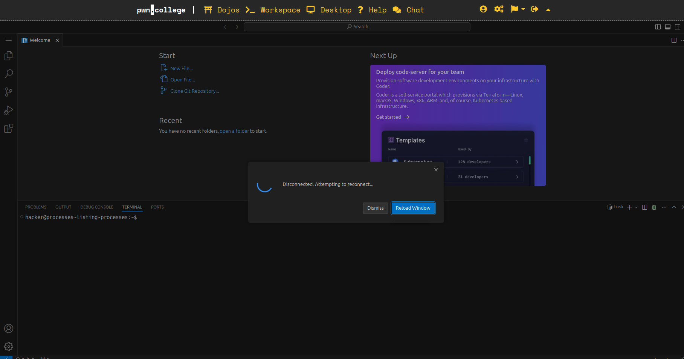

<h2>Linux Luminarium</h2>
 
<h3>Summary</h3>
  
For now i have completed 4/12 modules of Linux Luminarium and it is <em>sometime good and some time irritating</em>.Since i cleared a few levels of bandit ,Linux Luminarium has been easy so far.But i feel some questions are ambiguous and not clear so i got stuck in some questions.And when i have been stuck and i asked for help from one of my friend who has cleared all levels but even some of suggestions have not lead me anywhere :|.Like a command having the same logic works in his but doesnt work in mine so i have been more independent this time instead of just waiting for solutions .I have picked up on reading documentation a little bit ,but when the documentation is too big i still struggle a little bit 

 
<h3>Module 1</h3>

Had 2 problems so solved it quickly
 
<h3>Module 2</h3>

This  module was irritating not because it was hard .I felt the question instrcutions were not specific ,in some problems i didnt even understand why got the flag.I got stuck in one of the question ,i felt the logic was right so i asked one of my friends who had completed the problem ,he said some comamnd which was identical to mine but i still ran his command it didnt work.But when i ran a similar command with some changes it worked.Such thingss made me hate this module 

<b>Things i learned :</b>
<ul>
  <li>Absolute path</li>
  <li>Relative path</li>
  <li>~</li>
</ul> 
<h3>Module 3</h3>

I breezed through this module excdept one question realted symbolic link : Linked list question ,i asked the same friend for help and turns out i had actually linked the files right but the format i wa trying to print the flag was wrong.I was running <code>cat /challenge/not-theflag</code> thinking the flag was a ascii file and since not-the-flag linked to flag ,but instead i had to just run <code>/challenge/not-the-flag</code> .Since i has learned grep command in bandit over the wire ,i easily solved this question without reading the documentation.I did revise rm file and ls -a [since i knew about these before i did not add these in thing i learned  ] 

<b>Things i learned :</b>
<ul>
  <li>Types of file</li>
  <li>Symbolic links : <code>ln -s [targeted_file] [pointer]</code></li>
  <li>Hard Links : <code>ln [targeted_file] [pointer]</code></li></ul>
<h3>Module 4</h3>

Solved 6/7 problems .1 question left, i felt that the problem not solved yet is easy therfore investing more time to solve it

<b>Things i learned :</b>
<ul>
  <li>man command</li>
  <li>Search through documentation using <code>/ , n,N</code></li>
  <li><code>man man</code> : Reading to just documentation is hard but reading to the whole thing is harder.I'm not quite comfortable so will revise again</li>
  
</ul>
<h3>Module 5</h3>

Solved 5/6 problems .1 question left, i felt that the problem not solved yet is easy therfore investing more time to solve it.Learned ? * [] are some commands i used before but got a better understanding of these through this module

<b>Things i learned :</b>
<ul>
  <li>* </li>
  <li>?</li>
  <li>[ ]</li>
  
  
</ul>
<h3>Module 6</h3>

learned some new things and understood the ones i knew in a better view.I learned >& but not quite clear with idea,i chatgpted it but the logic given there and logic i used to solve didnt add up  <code>/challenge/run 2>&1 | grep "{"</code>So after some more searches i realised 2>&1 will seperate errors and stdout and pipes it to the grep .Am I right ?.Process submissiin is i will revising it .

<b>Things i learned :</b>
<ul>
  
  <li>>> for append mode</li>
  <li>Redirecting errors FC0,FD1,FD2 </li>
  <li>Revised pipe operator</li>
  <li>Tee command</li>
    <li>Process submission </li>

  
  
</ul>
<h3>Module 7</h3>

Completed this module pretty quickly ,learned about variable and how to export them and how they fucntion.Not so clear with the read command and it will one of the things im planning to revise

<b>Things i learned :</b>
<ul>
  <li>env</li>
  <li>Variables</li>
  <li>Storing command output</li>
  <li>read [Not so clear]</li>
  <li></li>

  
  
</ul>
h3>Module 8</h3>

This module seemed really intimidating when I first started,so i started procrastinating

<b>Things i learned :</b>
<ul>
  <li></li>
  <li></li>
  <li></li>

  
  
</ul>

Work in progress,I have not completed this task yet,im really sorry and i will try to complete it as soon as spossible 

