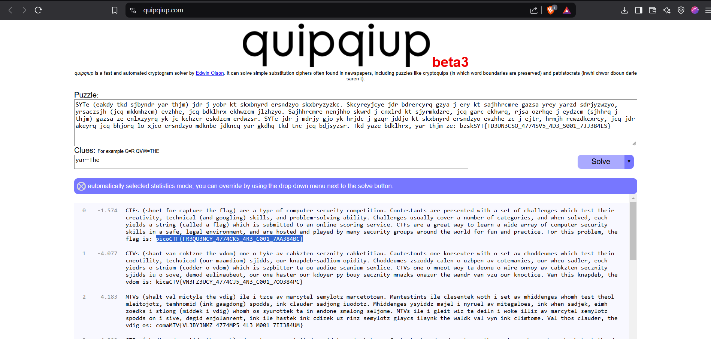
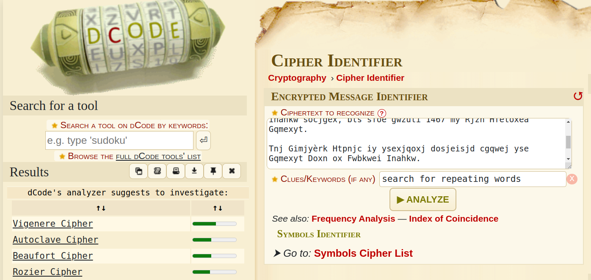
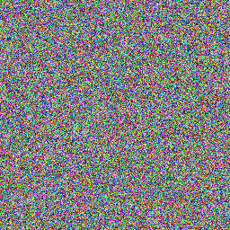
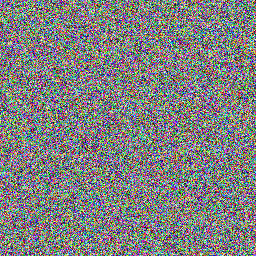
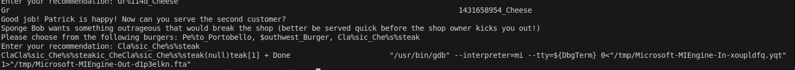
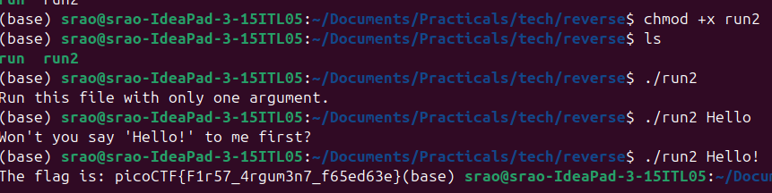
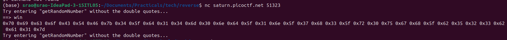
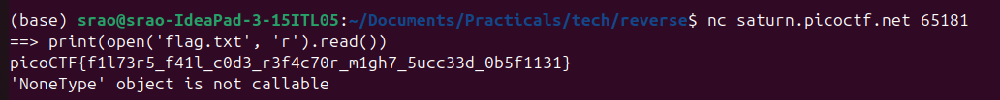

# Piko ctf
# 1)Cryptography

# Problem1.1 : substitution0
Problem statement : A message has come in but it seems to be all scrambled. Luckily it seems to have the key at the beginning. Can you crack this substitution cipher?
Download the message here.
>
## Solving  
I used the hint since it had specified there no no penalities for using hints.I used this [freuqncy tool](https://www.dcode.fr/frequency-analysis) and tried decoding it .After some more searching in the website i came across their [cipher identifier](https://www.dcode.fr/cipher-identifier) section .Tried the top two cipher matches (First result was not the cipher ) and found the given text matching with **Mono-alphabetic Substitution** .Used [this-decoder](https://www.dcode.fr/monoalphabetic-substitution) to get the flag
>
**Decrypted message :** ABCDEFGHIJKLMNOPQRSTUVWXYZ HEREUPON LEGRAND AROSE, WITH A GRAVE AND STATELY AIR, AND BROUGHT ME THE BEETLE FROM A GLASS CASE IN WHICH IT WAS ENCLOSED. IT WAS A BEAUTIFUL SCARABAEUS, AND, AT THAT TIME, UNKNOWN TO NATURALISTS--OF COURSE A GREAT PRIZE IN A SCIENTIFIC POINT OF VIEW. THERE WERE TWO ROUND BLACK SPOTS NEAR ONE EXTREMITY OF THE BACK, AND A LONG ONE NEAR THE OTHER. THE SCALES WERE EXCEEDINGLY HARD AND GLOSSY, WITH ALL THE APPEARANCE OF BURNISHED GOLD. THE WEIGHT OF THE INSECT WAS VERY REMARKABLE, AND, TAKING ALL THINGS INTO CONSIDERATION, I COULD HARDLY BLAME JUPITER FOR HIS OPINION RESPECTING IT. THE FLAG IS: PICOCTF{5UB5717U710N_3V0LU710N_03055505}
>
🔤₁	OHNFUMWSVZLXEGCPTAJDYIRKQB
🔤₂	RZOTMDNBVSXKFCAPYWHQEIGLUJ

**Flag**: PICOCTF{5UB5717U710N_3V0LU710N_03055505}


# Problem1.2 : substitution1


## Challenge
A second message has come in the mail, and it seems almost identical to the first one. Maybe the same thing will work again.  

**The text** : SYTe (eakdy tkd sjbyndr yar thjm) jdr j yobr kt skxbnyrd ersndzyo skxbryzyzkc. Skcyreyjcye jdr bdrercyrq gzya j ery kt sajhhrcmre gazsa yrey yarzd sdrjyzwzyo, yrsaczsjh (jcq mkkmhzcm) evzhhe, jcq bdklhrx-ekhwzcm jlzhzyo. Sajhhrcmre nenjhho skwrd j cnxlrd kt sjyrmkdzre, jcq garc ekhwrq, rjsa ozrhqe j eydzcm (sjhhrq j thjm) gazsa ze enlxzyyrq yk jc kchzcr eskdzcm erdwzsr. SYTe jdr j mdrjy gjo yk hrjdc j gzqr jddjo kt skxbnyrd ersndzyo evzhhe zc j ejtr, hrmjh rcwzdkcxrcy, jcq jdr akeyrq jcq bhjorq lo xjco ersndzyo mdknbe jdkncq yar gkdhq tkd tnc jcq bdjsyzsr. Tkd yaze bdklhrx, yar thjm ze: bzskSYT{TD3UN3CSO_4774SV5_4D3_S001_7JJ384LS}  

## Solving
_My thought process_ :*I tired the same tool as previous that is [Dcode](https://www.dcode.fr/cipher-identifier) tried top results but it didnt match any of them.From the previous flag i figured out that the last line will be same for every problem that _is Tkd yaze bdklhrx, yar thjm ze: bzskSYT{} is the flag is: picoCTF{}_  
I tried Mono-alphabetic Substitution next and it matched and i thought i got the flag*

CTFS (SHORT FOR CAPTURE THE FLAG) ARE A TYPE OF COMPUTER SECURITY COMPETITION. CONTESTANTS ARE PRESENTED WITH A SET OF CHALLENGES WHICH TEST THEIR CREATIVITY, TECHNICAL (AND GOOGLING) SKILLS, AND PROBLEM-SOLVING ABILITY. CHALLENGES USUALLY COVER A NUMBER OF CATEGORIES, AND WHEN SOLVED, EACH YIELDS A STRING (CALLED A FLAG) WHICH IS SUBMITTED TO AN ONLINE SCORING SERVICE. CTFS ARE A GREAT WAY TO LEARN A WIDE ARRAY OF COMPUTER SECURITY SKILLS IN A SAFE, LEGAL ENVIRONMENT, AND ARE HOSTED AND PLAYED BY MANY SECURITY GROUPS AROUND THE WORLD FOR FUN AND PRACTICE. FOR THIS PROBLEM, THE FLAG IS: PICOCTF{FR3JU3NCY_4774CK5_4R3_C001_7AA384BC}

*The flag was incorrect so i thought the that the issue was just case sensitivity.So i changed something and it still didnt work so i used a different tool for decrypting this time [quipqiup](https://quipqiup.com/) and added the words i knew in the clues section  and got the right flag.*

## **The decrypted text**

>CTFs (short for capture the flag) are a type of computer security competition. Contestants are presented with a set of challenges which test their creativity, technical (and googling) skills, and problem-solving ability. Challenges usually cover a number of categories, and when solved, each yields a string (called a flag) which is submitted to an online scoring service. CTFs are a great way to learn a wide array of computer security skills in a safe, legal environment, and are hosted and played by many security groups around the world for fun and practice. For this problem, the flag is: picoCTF{FR3QU3NCY_4774CK5_4R3_C001_7AA384BC}

## **The flag**

>picoCTF{FR3QU3NCY_4774CK5_4R3_C001_7AA384BC}



The initial flag was incorrect due to a single character difference.  
The Right Flag :picoCTF{FR3**Q**U3NCY_4774CK5_4R3_C001_7AA384BC}    
The Wrong flag :picoCTF{FR3**J**U3NCY_4774CK5_4R3_C001_7AA384BC}

--- 
  


# Problem 1.3 :substitution2

## Description
It seems that another encrypted message has been intercepted. The encryptor seems to have learned their lesson though and now there isn't any punctuation! Can you still crack the cipher?  
**The text** :nafyffoxenefufytpqnafymfppfentkpxeafbaxraezaqqpzqgswnfyefzwyxnhzqgsfnxnxqlexlzpwbxlrzhkfystnyxqntlbwezhkfyzatppflrfnafefzqgsfnxnxqlevqzwesyxgtyxphqlehenfgetbgxlxenytnxqlvwlbtgflntpemaxzatyfufyhwefvwptlbgtycfntkpfecxppeaqmfufymfkfpxfufnafsyqsfyswysqefqvtaxraezaqqpzqgswnfyefzwyxnhzqgsfnxnxqlxelqnqlphnqnftzautpwtkpfecxppekwntpeqnqrfnenwbflnexlnfyfenfbxltlbfozxnfbtkqwnzqgswnfyezxflzfbfvflexufzqgsfnxnxqletyfqvnflptkqyxqwetvvtxyetlbzqgfbqmlnqywllxlrzafzcpxenetlbfofzwnxlrzqlvxrezyxsneqvvflefqlnafqnafyatlbxeaftuxphvqzwefbqlfospqytnxqltlbxgsyquxetnxqltlbqvnflatefpfgflneqvspthmfkfpxfuftzqgsfnxnxqlnqwzaxlrqlnafqvvflexuffpfgflneqvzqgswnfyefzwyxnhxenafyfvqyftkfnnfyufaxzpfvqynfzafutlrfpxegnqenwbflnexltgfyxztlaxraezaqqpevwynafymfkfpxfufnatntlwlbfyentlbxlrqvqvvflexufnfzalxiwfexefeeflnxtpvqygqwlnxlrtlfvvfznxufbfvfleftlbnatnnafnqqpetlbzqlvxrwytnxqlvqzweflzqwlnfyfbxlbfvflexufzqgsfnxnxqlebqfelqnpftbenwbflnenqclqmnafxyflfghtefvvfznxufphtenftzaxlrnafgnqtznxufphnaxlcpxcftltnntzcfysxzqznvxetlqvvflexufphqyxflnfbaxraezaqqpzqgswnfyefzwyxnhzqgsfnxnxqlnatneffcenqrflfytnfxlnfyfenxlzqgswnfyezxflzftgqlraxraezaqqpfyenftzaxlrnafgflqwratkqwnzqgswnfyefzwyxnhnqsxiwfnafxyzwyxqexnhgqnxutnxlrnafgnqfospqyfqlnafxyqmltlbfltkpxlrnafgnqkfnnfybfvflbnafxygtzaxlfenafvptrxesxzqZNV{L6Y4G_4L41H515_15_73B10W5_8F1KV808}


# Problem 1.4 :la cifra de

## Description
**The text** :
Ne iy nytkwpsznyg nth it mtsztcy vjzprj zfzjy rkhpibj nrkitt ltc tnnygy ysee itd tte cxjltk

Ifrosr tnj noawde uk siyyzre, yse Bnretèwp Cousex mls hjpn xjtnbjytki xatd eisjd

Iz bls lfwskqj azycihzeej yz Brftsk ip Volpnèxj ls oy hay tcimnyarqj dkxnrogpd os 1553 my Mnzvgs Mazytszf Merqlsu ny hox moup Wa inqrg ipl. Ynr. Gotgat Gltzndtg Gplrfdo 

Ltc tnj tmvqpmkseaznzn uk ehox nivmpr g ylbrj ts ltcmki my yqtdosr tnj wocjc hgqq ol fy oxitngwj arusahje fuw ln guaaxjytrd catizm tzxbkw zf vqlckx hizm ceyupcz yz tnj fpvjc hgqqpohzCZK{m311a50_0x_a1rn3x3_h1ah3x6kp60egf}

Ehk ktryy herq-ooizxetypd jjdcxnatoty ol f aordllvmlbkytc inahkw socjgex, bls sfoe gwzuti 1467 my Rjzn Hfetoxea Gqmexyt.

Tnj Gimjyèrk Htpnjc iy ysexjqoxj dosjeisjd cgqwej yse Gqmexyt Doxn ox Fwbkwei Inahkw.

Tn 1508, Ptsatsps Zwttnjxiax tnbjytki ehk xz-cgqwej ylbaql rkhea (g rltxni ol xsilypd gqahggpty) ysaz bzuri wazjc bk f nroytcgq nosuznkse ol yse Bnretèwp Cousex.

Gplrfdo’y xpcuso butvlky lpvjlrki tn 1555 gx l cuseitzltoty ol yse lncsz. Yse rthex mllbjd ol yse gqahggpty fce tth snnqtki cemzwaxqj, bay ehk fwpnfmezx lnj yse osoed qptzjcs gwp mocpd hd xegsd ol f xnkrznoh vee usrgxp, wnnnh ify bk itfljcety hizm paim noxwpsvtydkse.  
## Solving
After connecting to the ssh i used [dcode](https://www.dcode.fr/frequency-analysis) to identify the cipher and found it was Vigenere Cipher and used the  decoder in the same websit but i was getting the decoded message in parts .I initially thought i got the wrong flag [I got a wrong lfag before so i assumed the same here] but when i entered the flag just to check ,turns out it was right flag.But the decoded message was parts right for various keys such as AFGL
I learned how vignere cipher works just to decode the whole and identify the correct key inorder to do it.
**Note:**-Learn  Vigenere Cipher to decode the whhole message  
Trying to build a python program to solve the cipher will add soon if i succeed


## **The decrypted text**
>The first well-documented description of a polyalphabetic cipher however, was made around 1467 by Leon Battista Alberti.  
>Bellaso’s second booklet appeared in 1555 as a continuation of the first. The lower halves of the alphabets are now shifted regularly, but the alphabets and the index letters are mixed by means of a mnemonic key phrase, which can be different with each correspondent.  
>Xz vgh lzrhkke pzsxxhtztj su Qrzohk ck Kofkcere as it was originally described in 1553 by Giovan Battista Bellaso in his book La cifra del. Sig. Giovan Battista Bellaso  
>For the implementation of this cipher a table is formed by sliding the lower half of an ordinary alphabet for an apparently random number of places with respect to the upper halfpicoCTF{b311a50_0r_v1gn3r3_c1ph3r6fe60eaa}
## **The flag**

>picoCTF{b311a50_0r_v1gn3r3_c1ph3r6fe60eaa}


```
#Steps connect to a ssh

1)nano file_name.sh  -- Opens the file/creates a file with file-name

2)Add the address here : 
  #!/bin/bash → Shebang line (tells the system to use Bash to run the script
  ssh user@192.168.1.100 - the connection adress  

3)chmod +x file_name.sh  
  chmod → Change file permissions.
  +x → Add execute permission.
  file_name.sh → The script you are modifying.

4)./connect.sh 
```

# Problem 1.5 : waves over lambda

## Description : We made a lot of substitutions to encrypt this. Can you decrypt it? Connect with nc jupiter.challenges.picoctf.org 13758.

**The text** :  
xzcgbywo sibi mo kzpb uqyg - ubivpicxk_mo_x_zdib_qyfney_ecdwubwykp
-------------------------------------------------------------------------------
yqijik ukzezbzdmwxs tybyfylzd ryo wsi wsmbe ozc zu ukzezb aydqzdmwxs tybyfylzd, y qyce zrcib riqq tczrc mc zpb emowbmxw mc smo zrc eyk, yce owmqq bififnibie yfzcg po zrmcg wz smo gqzzfk yce wbygmx eiyws, rsmxs syaaicie wsmbwiic kiybo ygz, yce rsmxs m osyqq eioxbmni mc mwo abzaib aqyxi. uzb wsi abioicw m rmqq zcqk oyk wsyw wsmo qycezrcibuzb oz ri poie wz xyqq smf, yqwszpgs si sybeqk oaicw y eyk zu smo qmui zc smo zrc iowywiryo y owbycgi wkai, kiw zci abiwwk ubivpicwqk wz ni fiw rmws, y wkai ynhixw yce dmxmzpo yce yw wsi oyfi wmfi oicoiqioo. npw si ryo zci zu wszoi oicoiqioo aibozco rsz ybi dibk riqq xyaynqi zu qzztmcg yuwib wsimb rzbqeqk yuuymbo, yce, yaaybicwqk, yuwib czwsmcg iqoi. ukzezb aydqzdmwxs, uzb mcowycxi, nigyc rmws cijw wz czwsmcg; smo iowywi ryo zu wsi ofyqqiow; si byc wz emci yw zwsib fic'o wynqio, yce uyowicie zc wsif yo y wzyek, kiw yw smo eiyws mw yaaiybie wsyw si sye y spcebie wszpoyce bzpnqio mc sybe xyos. yw wsi oyfi wmfi, si ryo yqq smo qmui zci zu wsi fzow oicoiqioo, uycwyowmxyq uiqqzro mc wsi rszqi emowbmxw. m biaiyw, mw ryo czw owpamemwkwsi fyhzbmwk zu wsioi uycwyowmxyq uiqqzro ybi osbire yce mcwiqqmgicw iczpgsnpw hpow oicoiqioocioo, yce y aixpqmyb cywmzcyq uzbf zu mw.

**Solving**  
Tried identifying the cipher using dcode suggested shift cipher and but the decoded messages were not right . Used [quipqiup](https://quipqiup.com/)  and got the flag.
# *NOTE*-search alternstive methods to solve

# *Decoded_Text*  
	congrats here is your flag - frequency_is_c_over_lambda_dnvtfrtayu ------------------------------------------------------------------------------- alexey fyodorovitch karamazov was the third son of fyodor pavlovitch karamazov, a land owner well known in our district in his own day, and still remembered among us owing to his gloomy and tragic death, which happened thirteen years ago, and which i shall describe in its proper place. for the present i will only say that this landownerfor so we used to call him, although he hardly spent a day of his life on his own estatewas a strange type, yet one pretty frequently to be met with, a type abject and vicious and at the same time senseless. but he was one of those senseless persons who are very well capable of looking after their worldly affairs, and, apparently, after nothing else. fyodor pavlovitch, for instance, began with next to nothing; his estate was of the smallest; he ran to dine at other men's tables, and fastened on them as a toady, yet at his death it appeared that he had a hundred thousand roubles in hard cash. at the same time, he was all his life one of the most senseless, fantastical fellows in the whole district. i repeat, it was not stupiditythe majority of these fantastical fellows are shrewd and intelligent enoughbut just senselessness, and a peculiar national form of it.
# *Flag*
>frequency_is_c_over_lambda_dnvtfrtayu

 

# Problem 1.6 : Pixelated

## Description :  I have these 2 images, can you make a flag out of them?
 
 


**The text** : 

# Problem 1.6 : C3

## Description :
This is the Custom Cyclical Cipher!
Download the ciphertext here.
Download the encoder here.
Enclose the flag in our wrapper for submission. If the flag was "example" you would submit "picoCTF{example}".

**The text/The python program** :
```
import sys
chars = ""
from fileinput import input
for line in input():
  chars += line

lookup1 = "\n \"#()*+/1:=[]abcdefghijklmnopqrstuvwxyz"
lookup2 = "ABCDEFGHIJKLMNOPQRSTabcdefghijklmnopqrst"

out = ""

prev = 0
for char in chars:
  cur = lookup1.index(char)
  out += lookup2[(cur - prev) % 40]
  prev = cur

sys.stdout.write(out)
```
# *Solving*
The main was to convert the cipher to its orignal form so i wrote the program to do it .
```
import sys
chars="DLSeGAGDgBNJDQJDCFSFnRBIDjgHoDFCFtHDgJpiHtGDmMAQFnRBJKkBAsTMrsPSDDnEFCFtIbEDtDCIbFCFtHTJDKerFldbFObFCFtLBFkBAAAPFnRBJGEkerFlcPgKkImHnIlATJDKbTbFOkdNnsgbnJRMFnRBNAFkBAAAbrcbTKAkOgFpOgFpOpkBAAAAAAAiClFGIPFnRBaKliCgClFGtIBAAAAAAAOgGEkImHnIl"
lookup1 = "\n \"#()*+/1:=[]abcdefghijklmnopqrstuvwxyz"
lookup2 = "ABCDEFGHIJKLMNOPQRSTabcdefghijklmnopqrst"

out = ""

prev = 0
for char in chars:
    new = lookup2.index(char)
    temp = lookup1[(new + prev) % 40]
    out+=temp
    prev = lookup1.index(temp)

sys.stdout.write(out)
``` 
The output was another python program
```
#asciiorder
#fortychars
#selfinput
#pythontwo

chars = ""
from fileinput import input
for line in input():
    chars += line
b = 1 / 1

for i in range(len(chars)):
    if i == b * b * b:
        print chars[i] #prints
        b += 1 / 1
```
I initally tried adding the intial cipher as input but did not get the out then saw that it required it was self input .Then just modified some parts of the code to get the desired that is convert python 3 to python 2 code and store the whole program text in a string .
Later on I tried downloading python2 to execute but ran into a lot of installation errors so asked one of my friends but he gave a one line python program i still dont understand that well .Linked both the codes here for future reference
```
1)
chars = """#asciiorder
#fortychars
#selfinput
#pythontwo

chars = ""
from fileinput import input
for line in input():
    chars += line
b = 1 / 1

for i in range(len(chars)):
    if i == b * b * b:
        print chars[i] #prints
        b += 1 / 1
"""
b = 1
for i in range(len(chars)):
    if(i == b * b * b):
        print(chars[i]) #prints
        b += 1 


2)
chars = """\
#asciiorder
#fortychars
#selfinput
#pythontwo

chars = ""
from fileinput import input
for line in input():
    chars += line
b = 1 / 1

for i in range(len(chars)):
    if i == b * b * b:
        print chars[i] #prints
        b += 1 / 1

"""

print("picoCTF{" + (exec("b=[1]") or str()) + "".join((exec("b[0]+=1") or chr) for idx, chr in enumerate(chars) if idx == b[0] ** 3) + "}")
```
#**Flag**
>picoCTF{adlibs}


# 2)Binary Exploitation

# Problem 2.1 : 

## Description :
Getting root access can allow you to read the flag. Luckily there is a python file that you might like to play with.
Additional details will be available after launching your challenge instance.

**The text/The python program** :

# Problem 2.2:format string 0
## Description :
#include <stdio.h>
#include <stdlib.h>
#include <string.h>
#include <signal.h>
#include <unistd.h>
#include <sys/types.h>
```

#define BUFSIZE 32
#define FLAGSIZE 64

char flag[FLAGSIZE];

void sigsegv_handler(int sig) {
    printf("\n%s\n", flag);
    fflush(stdout);
    exit(1);
}

int on_menu(char *burger, char *menu[], int count) {
    for (int i = 0; i < count; i++) {
        if (strcmp(burger, menu[i]) == 0)
            return 1;
    }
    return 0;
}

void serve_patrick();

void serve_bob();


int main(int argc, char **argv){
    FILE *f = fopen("flag.txt", "r");
    if (f == NULL) {
        printf("%s %s", "Please create 'flag.txt' in this directory with your",
                        "own debugging flag.\n");
        exit(0);
    }

    fgets(flag, FLAGSIZE, f);
    signal(SIGSEGV, sigsegv_handler);

    gid_t gid = getegid();
    setresgid(gid, gid, gid);

    serve_patrick();
  
    return 0;
}

void serve_patrick() {
    printf("%s %s\n%s\n%s %s\n%s",
            "Welcome to our newly-opened burger place Pico 'n Patty!",
            "Can you help the picky customers find their favorite burger?",
            "Here comes the first customer Patrick who wants a giant bite.",
            "Please choose from the following burgers:",
            "Breakf@st_Burger, Gr%114d_Cheese, Bac0n_D3luxe",
            "Enter your recommendation: ");
    fflush(stdout);

    char choice1[BUFSIZE];
    scanf("%s", choice1);
    char *menu1[3] = {"Breakf@st_Burger", "Gr%114d_Cheese", "Bac0n_D3luxe"};
    if (!on_menu(choice1, menu1, 3)) {
        printf("%s", "There is no such burger yet!\n");
        fflush(stdout);
    } else {
        int count = printf(choice1);
        if (count > 2 * BUFSIZE) {
            serve_bob();
        } else {
            printf("%s\n%s\n",
                    "Patrick is still hungry!",
                    "Try to serve him something of larger size!");
            fflush(stdout);
        }
    }
}

void serve_bob() {
    printf("\n%s %s\n%s %s\n%s %s\n%s",
            "Good job! Patrick is happy!",
            "Now can you serve the second customer?",
            "Sponge Bob wants something outrageous that would break the shop",
            "(better be served quick before the shop owner kicks you out!)",
            "Please choose from the following burgers:",
            "Pe%to_Portobello, $outhwest_Burger, Cla%sic_Che%s%steak",
            "Enter your recommendation: ");
    fflush(stdout);

    char choice2[BUFSIZE];
    scanf("%s", choice2);
    char *menu2[3] = {"Pe%to_Portobello", "$outhwest_Burger", "Cla%sic_Che%s%steak"};
    if (!on_menu(choice2, menu2, 3)) {
        printf("%s", "There is no such burger yet!\n");
        fflush(stdout);
    } else {
        printf(choice2);
        fflush(stdout);
    }
}
```
I just went through the program and entered based on details like format specifier and string size .But the flag was not being printed for some reason when i checked online whhat i did was right and people would get the flag after doign what i did .
# A doubt/issue

### Solving :  
1)Create a flag.txt file with a dummy flag  
2)When menu asks for an input enter  
>Gr%114d_Cheese // because it has %114 so the will be more than the buffsize decalred  

3)When the menu asks again for an input enter  
>Cla%sic_Che%s%steak // since as per  the program only this is the right choice

### flag
>    
# Problem 2.3: format string 1
## Description :
Description
Patrick and Sponge Bob were really happy with those orders you made for them, but now they're curious about the secret menu. Find it, and along the way, maybe you'll find something else of interest!
Download the binary here.
Download the source here.
Additional details will be available after launching your challenge instance.
## The program
```

```
## Solving
Solved and got the wrong answer - will add the writeup after completing

# 3)Web Exploitation

## *Problem 3.1:hijacking*
## Challenge
Who doesn't love cookies? Try to figure out the best one. http://mercury.picoctf.net:64944/


## Solving

From the question i realised we are supposed to find the tag from or using cookies .I thought if we enter the write word the flag would be avaiable in cookies.So instead of checking the cookies beofre entering and after enetring .I just checked the cookies after eneteing the word .I was actually supposed to check what value changes when i provide a input and how to manipulate it.Since my approach was wrong i was stuck for sometime so i decided to check a youtube video then realised my mistake.Before entering a word the value of the cookie is 0 and after enetering it changes to 1.So on changing that value we get different words.When the value is 18 we get the fla

## *The flag*
>picoCTF{3v3ry1_l0v3s_c00k135_cc9110ba}


# 4)Reverse Engineering
## *Problem4.1:file-run1*

### challenge
A program has been provided to you, what happens if you try to run it on the command line?  
### solving
Just tried executing the file got the persmission denied.When i checked the hint and made the file executable using 
>chmod +x run
Executed the file again and got the output

### *The flag*:
>picoCTF{U51N6_Y0Ur_F1r57_F113_9bc52b6b}

## *Problem 4.2:file-run2*

### Description
Another program, but this time, it seems to want some input. What happens if you try to run it on the command line with input "Hello!"?
Download the program here.

### Solving
Gave executable permsission to the file and provided "Hello!" as argument and got the flag


### *The flag:*
>picoCTF{F1r57_4rgum3n7_f65ed63e}

## *Problem 4.3:*

### Description:
Can you open this safe?
I forgot the key to my safe but this program is supposed to help me with retrieving the lost key. Can you help me unlock my safe?
Put the password you recover into the picoCTF flag format like:

### Solving:
When i opened the java file i found that inorder to open the safe the follwing funvvtion was called at the end
```
public static boolean openSafe(String password) {
        String encodedkey = "cGwzYXMzX2wzdF9tM18xbnQwX3RoM19zYWYz";//I thought this was the password and entered this first
        
        if (password.equals(encodedkey)) {
            System.out.println("Sesame open");
            return true;
        }
        else {
            System.out.println("Password is incorrect\n");
            return false;
        }


```
The program was converting the input to base 64 and in compare it with *cGwzYXMzX2wzdF9tM18xbnQwX3RoM19zYWYz* so i used a decoder converted it back and entered it as the password.The password was **pl3as3_l3t_m3_1nt0_th3_saf3**

### *flag*:
>picoCTF{pl3as3_l3t_m3_1nt0_th3_saf3}

## *Problem 4.4:Picker I*

### Description:
This service can provide you with a random number, but can it do anything else?
### Solving :
Downloaded the python file and went through the code.win function was giving the flag so called it ,I intially didnt check the input to be provided .[later on realised that we call the function by enetering win].But the function was not just reading the the local flag.txt and convertingit into hex.So i understood my approach was wrong and while checking the second time i understood the input to provided was win.Again same.Launched the instance and then enetered win and got the flag
in hex .Converted it and got the flag

### *The Flag:*
>picoCTF{4_d14m0nd_1n_7h3_r0ugh_b523b2a1}

## *Problem 4.5:Picker II*

### Description :
Can you figure out how this program works to get the flag?
Additional details will be available after launching your challenge instance.

### Solving :
The program was the same as previous but we have to get the flag without entering win.Based on the hint i figured out i understood we have to enter the file open line of the program as input and remove the brackerts ate the end.I assummed i was supposed to use a function call to get the flag but that was not the case .It excuted without any error but i was not getting the flag.
Wasted sometime on this and later decided to google it.I should have just printed the file opened and should have ignored the brackets at the end .



### *The flag :*
>picoCTF{f1l73r5_f41l_c0d3_r3f4c70r_m1gh7_5ucc33d_0b5f1131}