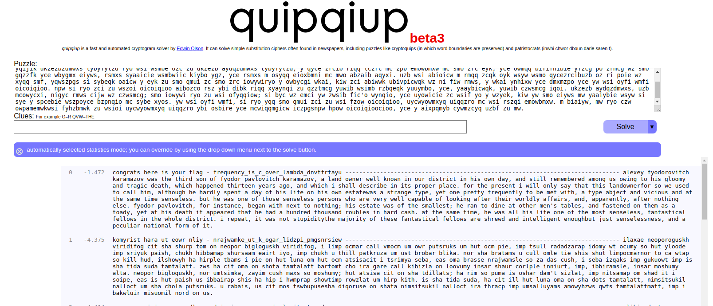

# Piko ctf
# 1)Cryptography

# Problem1 : substitution0
Problem statement : A message has come in but it seems to be all scrambled. Luckily it seems to have the key at the beginning. Can you crack this substitution cipher?
Download the message here.
>
## Solving  
I used the hint since it had specified there no no penalities for using hints.I used this [freuqncy tool](https://www.dcode.fr/frequency-analysis) and tried decoding it .After some more searching in the website i came across their [cipher identifier](https://www.dcode.fr/cipher-identifier) section .Tried the top two cipher matches (First result was not the cipher ) and found the given text matching with **Mono-alphabetic Substitution** .Used [this-decoder](https://www.dcode.fr/monoalphabetic-substitution) to get the flag
>
**Decrypted message :**ABCDEFGHIJKLMNOPQRSTUVWXYZ HEREUPON LEGRAND AROSE, WITH A GRAVE AND STATELY AIR, AND BROUGHT ME THE BEETLE FROM A GLASS CASE IN WHICH IT WAS ENCLOSED. IT WAS A BEAUTIFUL SCARABAEUS, AND, AT THAT TIME, UNKNOWN TO NATURALISTS--OF COURSE A GREAT PRIZE IN A SCIENTIFIC POINT OF VIEW. THERE WERE TWO ROUND BLACK SPOTS NEAR ONE EXTREMITY OF THE BACK, AND A LONG ONE NEAR THE OTHER. THE SCALES WERE EXCEEDINGLY HARD AND GLOSSY, WITH ALL THE APPEARANCE OF BURNISHED GOLD. THE WEIGHT OF THE INSECT WAS VERY REMARKABLE, AND, TAKING ALL THINGS INTO CONSIDERATION, I COULD HARDLY BLAME JUPITER FOR HIS OPINION RESPECTING IT. THE FLAG IS: PICOCTF{5UB5717U710N_3V0LU710N_03055505}
>
🔤₁	OHNFUMWSVZLXEGCPTAJDYIRKQB
🔤₂	RZOTMDNBVSXKFCAPYWHQEIGLUJ

**Flag**: PICOCTF{5UB5717U710N_3V0LU710N_03055505}


# Problem2 : substitution1


## Challenge
A second message has come in the mail, and it seems almost identical to the first one. Maybe the same thing will work again.  

**The text** : SYTe (eakdy tkd sjbyndr yar thjm) jdr j yobr kt skxbnyrd ersndzyo skxbryzyzkc. Skcyreyjcye jdr bdrercyrq gzya j ery kt sajhhrcmre gazsa yrey yarzd sdrjyzwzyo, yrsaczsjh (jcq mkkmhzcm) evzhhe, jcq bdklhrx-ekhwzcm jlzhzyo. Sajhhrcmre nenjhho skwrd j cnxlrd kt sjyrmkdzre, jcq garc ekhwrq, rjsa ozrhqe j eydzcm (sjhhrq j thjm) gazsa ze enlxzyyrq yk jc kchzcr eskdzcm erdwzsr. SYTe jdr j mdrjy gjo yk hrjdc j gzqr jddjo kt skxbnyrd ersndzyo evzhhe zc j ejtr, hrmjh rcwzdkcxrcy, jcq jdr akeyrq jcq bhjorq lo xjco ersndzyo mdknbe jdkncq yar gkdhq tkd tnc jcq bdjsyzsr. Tkd yaze bdklhrx, yar thjm ze: bzskSYT{TD3UN3CSO_4774SV5_4D3_S001_7JJ384LS}  

## Solving
_My thought process_ :*I tired the same tool as previous that is [Dcode](https://www.dcode.fr/cipher-identifier) tried top results but it didnt match any of them.From the previous flag i figured out that the last line will be same for every problem that _is Tkd yaze bdklhrx, yar thjm ze: bzskSYT{} is the flag is: picoCTF{}_  
I tried Mono-alphabetic Substitution next and it matched and i thought i got the flag*

CTFS (SHORT FOR CAPTURE THE FLAG) ARE A TYPE OF COMPUTER SECURITY COMPETITION. CONTESTANTS ARE PRESENTED WITH A SET OF CHALLENGES WHICH TEST THEIR CREATIVITY, TECHNICAL (AND GOOGLING) SKILLS, AND PROBLEM-SOLVING ABILITY. CHALLENGES USUALLY COVER A NUMBER OF CATEGORIES, AND WHEN SOLVED, EACH YIELDS A STRING (CALLED A FLAG) WHICH IS SUBMITTED TO AN ONLINE SCORING SERVICE. CTFS ARE A GREAT WAY TO LEARN A WIDE ARRAY OF COMPUTER SECURITY SKILLS IN A SAFE, LEGAL ENVIRONMENT, AND ARE HOSTED AND PLAYED BY MANY SECURITY GROUPS AROUND THE WORLD FOR FUN AND PRACTICE. FOR THIS PROBLEM, THE FLAG IS: PICOCTF{FR3JU3NCY_4774CK5_4R3_C001_7AA384BC}

*The flag was incorrect so i thought the that the issue was just case sensitivity.So i changed something and it still didnt work so i used a different tool for decrypting this time [quipqiup](https://quipqiup.com/) and added the words i knew in the clues section  and got the right flag.*

## **The decrypted text**

>CTFs (short for capture the flag) are a type of computer security competition. Contestants are presented with a set of challenges which test their creativity, technical (and googling) skills, and problem-solving ability. Challenges usually cover a number of categories, and when solved, each yields a string (called a flag) which is submitted to an online scoring service. CTFs are a great way to learn a wide array of computer security skills in a safe, legal environment, and are hosted and played by many security groups around the world for fun and practice. For this problem, the flag is: picoCTF{FR3QU3NCY_4774CK5_4R3_C001_7AA384BC}

## **The flag**

>picoCTF{FR3QU3NCY_4774CK5_4R3_C001_7AA384BC}


The initial flag was incorrect due to a single character difference.  
The Right Flag :picoCTF{FR3**Q**U3NCY_4774CK5_4R3_C001_7AA384BC}    
The Wrong flag :picoCTF{FR3**J**U3NCY_4774CK5_4R3_C001_7AA384BC}

--- 
  


# Problem 3 :substitution2

## Description
It seems that another encrypted message has been intercepted. The encryptor seems to have learned their lesson though and now there isn't any punctuation! Can you still crack the cipher?  
**The text** :nafyffoxenefufytpqnafymfppfentkpxeafbaxraezaqqpzqgswnfyefzwyxnhzqgsfnxnxqlexlzpwbxlrzhkfystnyxqntlbwezhkfyzatppflrfnafefzqgsfnxnxqlevqzwesyxgtyxphqlehenfgetbgxlxenytnxqlvwlbtgflntpemaxzatyfufyhwefvwptlbgtycfntkpfecxppeaqmfufymfkfpxfufnafsyqsfyswysqefqvtaxraezaqqpzqgswnfyefzwyxnhzqgsfnxnxqlxelqnqlphnqnftzautpwtkpfecxppekwntpeqnqrfnenwbflnexlnfyfenfbxltlbfozxnfbtkqwnzqgswnfyezxflzfbfvflexufzqgsfnxnxqletyfqvnflptkqyxqwetvvtxyetlbzqgfbqmlnqywllxlrzafzcpxenetlbfofzwnxlrzqlvxrezyxsneqvvflefqlnafqnafyatlbxeaftuxphvqzwefbqlfospqytnxqltlbxgsyquxetnxqltlbqvnflatefpfgflneqvspthmfkfpxfuftzqgsfnxnxqlnqwzaxlrqlnafqvvflexuffpfgflneqvzqgswnfyefzwyxnhxenafyfvqyftkfnnfyufaxzpfvqynfzafutlrfpxegnqenwbflnexltgfyxztlaxraezaqqpevwynafymfkfpxfufnatntlwlbfyentlbxlrqvqvvflexufnfzalxiwfexefeeflnxtpvqygqwlnxlrtlfvvfznxufbfvfleftlbnatnnafnqqpetlbzqlvxrwytnxqlvqzweflzqwlnfyfbxlbfvflexufzqgsfnxnxqlebqfelqnpftbenwbflnenqclqmnafxyflfghtefvvfznxufphtenftzaxlrnafgnqtznxufphnaxlcpxcftltnntzcfysxzqznvxetlqvvflexufphqyxflnfbaxraezaqqpzqgswnfyefzwyxnhzqgsfnxnxqlnatneffcenqrflfytnfxlnfyfenxlzqgswnfyezxflzftgqlraxraezaqqpfyenftzaxlrnafgflqwratkqwnzqgswnfyefzwyxnhnqsxiwfnafxyzwyxqexnhgqnxutnxlrnafgnqfospqyfqlnafxyqmltlbfltkpxlrnafgnqkfnnfybfvflbnafxygtzaxlfenafvptrxesxzqZNV{L6Y4G_4L41H515_15_73B10W5_8F1KV808}


# Problem 4 :la cifra de

## Description
**The text** :
Ne iy nytkwpsznyg nth it mtsztcy vjzprj zfzjy rkhpibj nrkitt ltc tnnygy ysee itd tte cxjltk

Ifrosr tnj noawde uk siyyzre, yse Bnretèwp Cousex mls hjpn xjtnbjytki xatd eisjd

Iz bls lfwskqj azycihzeej yz Brftsk ip Volpnèxj ls oy hay tcimnyarqj dkxnrogpd os 1553 my Mnzvgs Mazytszf Merqlsu ny hox moup Wa inqrg ipl. Ynr. Gotgat Gltzndtg Gplrfdo 

Ltc tnj tmvqpmkseaznzn uk ehox nivmpr g ylbrj ts ltcmki my yqtdosr tnj wocjc hgqq ol fy oxitngwj arusahje fuw ln guaaxjytrd catizm tzxbkw zf vqlckx hizm ceyupcz yz tnj fpvjc hgqqpohzCZK{m311a50_0x_a1rn3x3_h1ah3x6kp60egf}

Ehk ktryy herq-ooizxetypd jjdcxnatoty ol f aordllvmlbkytc inahkw socjgex, bls sfoe gwzuti 1467 my Rjzn Hfetoxea Gqmexyt.

Tnj Gimjyèrk Htpnjc iy ysexjqoxj dosjeisjd cgqwej yse Gqmexyt Doxn ox Fwbkwei Inahkw.

Tn 1508, Ptsatsps Zwttnjxiax tnbjytki ehk xz-cgqwej ylbaql rkhea (g rltxni ol xsilypd gqahggpty) ysaz bzuri wazjc bk f nroytcgq nosuznkse ol yse Bnretèwp Cousex.

Gplrfdo’y xpcuso butvlky lpvjlrki tn 1555 gx l cuseitzltoty ol yse lncsz. Yse rthex mllbjd ol yse gqahggpty fce tth snnqtki cemzwaxqj, bay ehk fwpnfmezx lnj yse osoed qptzjcs gwp mocpd hd xegsd ol f xnkrznoh vee usrgxp, wnnnh ify bk itfljcety hizm paim noxwpsvtydkse.  
## Solving
After connecting to the ssh i used [dcode](https://www.dcode.fr/frequency-analysis) to identify the cipher and found it was Vigenere Cipher and used the  decoder in the same websit but i was getting the decoded message in parts .I initially thought i got the wrong flag [I got a wrong lfag before so i assumed the same here] but when i entered the flag just to check ,turns out it was right flag.But the decoded message was parts right for various keys such as AFGL
I learned how vignere cipher works just to decode the whole and identify the correct key inorder to do it.
**Note:**-Learn  Vigenere Cipher to decode the whhole message  
Trying to build a python program to solve the cipher will add soon if i succeed


## **The decrypted text**
>The first well-documented description of a polyalphabetic cipher however, was made around 1467 by Leon Battista Alberti.  
>Bellaso’s second booklet appeared in 1555 as a continuation of the first. The lower halves of the alphabets are now shifted regularly, but the alphabets and the index letters are mixed by means of a mnemonic key phrase, which can be different with each correspondent.  
>Xz vgh lzrhkke pzsxxhtztj su Qrzohk ck Kofkcere as it was originally described in 1553 by Giovan Battista Bellaso in his book La cifra del. Sig. Giovan Battista Bellaso  
>For the implementation of this cipher a table is formed by sliding the lower half of an ordinary alphabet for an apparently random number of places with respect to the upper halfpicoCTF{b311a50_0r_v1gn3r3_c1ph3r6fe60eaa}
## **The flag**

>picoCTF{b311a50_0r_v1gn3r3_c1ph3r6fe60eaa}


```
#Steps connect to a ssh

1)nano file_name.sh  -- Opens the file/creates a file with file-name

2)Add the address here : 
  #!/bin/bash → Shebang line (tells the system to use Bash to run the script
  ssh user@192.168.1.100 - the connection adress  

3)chmod +x file_name.sh  
  chmod → Change file permissions.
  +x → Add execute permission.
  file_name.sh → The script you are modifying.

4)./connect.sh 
```

# Problem 5 : waves over lambda

## Description : We made a lot of substitutions to encrypt this. Can you decrypt it? Connect with nc jupiter.challenges.picoctf.org 13758.

**The text** :  
xzcgbywo sibi mo kzpb uqyg - ubivpicxk_mo_x_zdib_qyfney_ecdwubwykp
-------------------------------------------------------------------------------
yqijik ukzezbzdmwxs tybyfylzd ryo wsi wsmbe ozc zu ukzezb aydqzdmwxs tybyfylzd, y qyce zrcib riqq tczrc mc zpb emowbmxw mc smo zrc eyk, yce owmqq bififnibie yfzcg po zrmcg wz smo gqzzfk yce wbygmx eiyws, rsmxs syaaicie wsmbwiic kiybo ygz, yce rsmxs m osyqq eioxbmni mc mwo abzaib aqyxi. uzb wsi abioicw m rmqq zcqk oyk wsyw wsmo qycezrcibuzb oz ri poie wz xyqq smf, yqwszpgs si sybeqk oaicw y eyk zu smo qmui zc smo zrc iowywiryo y owbycgi wkai, kiw zci abiwwk ubivpicwqk wz ni fiw rmws, y wkai ynhixw yce dmxmzpo yce yw wsi oyfi wmfi oicoiqioo. npw si ryo zci zu wszoi oicoiqioo aibozco rsz ybi dibk riqq xyaynqi zu qzztmcg yuwib wsimb rzbqeqk yuuymbo, yce, yaaybicwqk, yuwib czwsmcg iqoi. ukzezb aydqzdmwxs, uzb mcowycxi, nigyc rmws cijw wz czwsmcg; smo iowywi ryo zu wsi ofyqqiow; si byc wz emci yw zwsib fic'o wynqio, yce uyowicie zc wsif yo y wzyek, kiw yw smo eiyws mw yaaiybie wsyw si sye y spcebie wszpoyce bzpnqio mc sybe xyos. yw wsi oyfi wmfi, si ryo yqq smo qmui zci zu wsi fzow oicoiqioo, uycwyowmxyq uiqqzro mc wsi rszqi emowbmxw. m biaiyw, mw ryo czw owpamemwkwsi fyhzbmwk zu wsioi uycwyowmxyq uiqqzro ybi osbire yce mcwiqqmgicw iczpgsnpw hpow oicoiqioocioo, yce y aixpqmyb cywmzcyq uzbf zu mw.

**Solving**  
Tried identifying the cipher using dcode suggested shift cipher and but the decoded messages were not right . Used [quipqiup](https://quipqiup.com/)  and got the flag.
# *NOTE*-search alternstive methods to solve

# *Decoded_Text*  
	congrats here is your flag - frequency_is_c_over_lambda_dnvtfrtayu ------------------------------------------------------------------------------- alexey fyodorovitch karamazov was the third son of fyodor pavlovitch karamazov, a land owner well known in our district in his own day, and still remembered among us owing to his gloomy and tragic death, which happened thirteen years ago, and which i shall describe in its proper place. for the present i will only say that this landownerfor so we used to call him, although he hardly spent a day of his life on his own estatewas a strange type, yet one pretty frequently to be met with, a type abject and vicious and at the same time senseless. but he was one of those senseless persons who are very well capable of looking after their worldly affairs, and, apparently, after nothing else. fyodor pavlovitch, for instance, began with next to nothing; his estate was of the smallest; he ran to dine at other men's tables, and fastened on them as a toady, yet at his death it appeared that he had a hundred thousand roubles in hard cash. at the same time, he was all his life one of the most senseless, fantastical fellows in the whole district. i repeat, it was not stupiditythe majority of these fantastical fellows are shrewd and intelligent enoughbut just senselessness, and a peculiar national form of it.
# *Flag*
>frequency_is_c_over_lambda_dnvtfrtayu

 

# Problem 6 : Pixelated

## Description :  I have these 2 images, can you make a flag out of them?
 
 


**The text** : 
